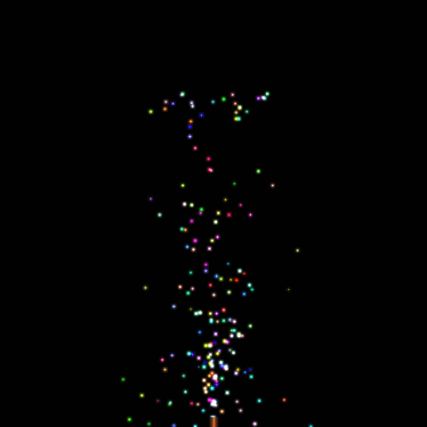
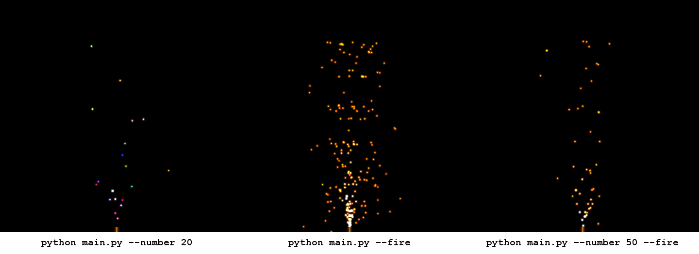

# Particle System

A simple particle system implemented with Python and OpenCL.

## Run demo

Go to the `src/` directory and run ```python main.py```.
This opens a window showing firework-like particle behavior as seen in the animation below.
Exit by pressing ESC.



Requirements:

* Python 3
* NumPy
* OpenCV
* OpenCL

## Program options

Use the help option to see all program options.

```
> python main.py --help
usage: main.py [-h] [--number NUMBER] [--fire] [--dump]

Particle system.

optional arguments:
  -h, --help       show this help message and exit
  --number NUMBER  number of particles (default value is 200)
  --fire           use fire-like color
  --dump           dump frames
```

The following illustration shows three possible settings.

